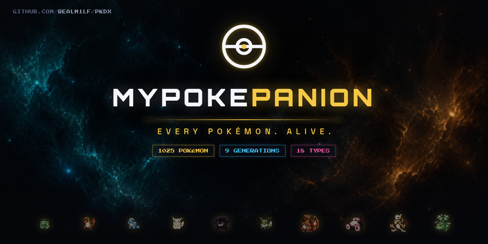

<p align="center">
  
</p>

<p align="center">
  <a href="https://github.com/realM1lF/pkdx/actions/workflows/ci.yml">
    
  </a>
  <a href="https://github.com/realM1lF/pkdx/stargazers">
    
  </a>
  <a href="https://mypokepanion.com/en">
    
  </a>
</p>

<p align="center">
  If this project helps your runs, consider giving it a ⭐ on GitHub.
</p>

# MyPokePanion

An interactive Pokédex and companion tool for Pokémon players — a dark,
data-dense single-page app covering all 1025 Pokémon from Generations 1–9.
Beyond the dex itself, it ships region maps with encounter locations, a
Nuzlocke tracker with real-time multiplayer, a competitive team builder, and
a generation-accurate damage calculator. The whole app runs bilingually
(English/German) with SEO-grade URL language routing.

This is a fan project, built for reference and play support — not affiliated
with Nintendo (see [License & Legal](#license--legal)).

## Features

- **Pokédex** — all 1025 Pokémon (Gen 1–9) with detail pages: stats, types,
  abilities, moves, evolution chains, sprites across all generations, and
  cries; fast fuzzy search (fuse.js) in both languages.
- **Region Maps** — five regions (Kanto, Johto, Hoenn, Sinnoh, Unova), each
  with a custom schematic view *and* the original in-game overworld map with
  geo-located markers and encounter/location data.
- **Nuzlocke Tracker** — solo mode (localStorage, works fully offline) and
  real-time multiplayer via Supabase: invite codes (`SOUL-XXX`), presence,
  live sync; configurable ruleset including Dupes Clause, Shiny Clause,
  nicknames, SoulLink (with death cascade), release-on-death, and manual or
  automatic level caps (next gym leader's ace). Runs work in every region:
  the five mapped regions plus Gen 6–9 (Kalos, Alola, Galar, Hisui, Paldea)
  in a map-less text mode with full location lists.
- **Team Builder** — 6-slot teams with level, moves, item, ability, nature
  and EVs; game/version-group selector (RBY through SV) with gen-aware
  legality checks; defensive synergy and offensive coverage analysis; Smogon
  OU set suggestions; Pokémon Showdown import/export; URL-hash team sharing;
  import of Nuzlocke run teams.
- **Versus Lab** — 1v1 matchup calculator on `@smogon/calc` with
  generation-correct mechanics for Gen 1–9 (damage ranges, KO chances, speed
  checks) plus per-generation type charts from `@pkmn/data`; field, weather
  and terrain context. It also includes a **playable 1v1 micro-battle arena**
  powered by `@pkmn/sim` with turn-based combat, a battle log, two AI modes
  (random and greedy), HP bars and status/weather/terrain tracking.
  Deep-linkable (`/versus?you=<id>&game=<vg>&vs=<id>`).
- **Item Lexicon** (`/items`) — 1,000+ items with sprites, categories,
  localized flavor texts; moves/items/abilities open detail modals (German
  and English flavor text) from every part of the app.
- **Accounts** — optional username+password login (no email) with 6-digit
  recovery PIN; teams and Nuzlocke runs sync across devices (local-first,
  guests keep full functionality with browser-only storage). `/account`.
- **Site pages** — `/about` (why this exists), `/feedback` (bug reports and
  feature requests via GitHub issue forms), `/support` (donations).
- **Performance details** — listing sprites for all 1025 Pokémon (front +
  shiny) ship with the app instead of being fetched from a third-party CDN;
  heavy data artifacts load lazily on first use.
- **Zoom control** — browser-style 50–150 % page zoom next to the language
  switch (root font-size scaling, persisted).
- **Bilingual UI (EN/DE)** — every route exists under `/en/…` and `/de/…`
  with hreflang annotations; official German game terminology.

## Tech Stack

| Area | Choice |
|---|---|
| Runtime / build | Node.js 20 · Vite 7 · TypeScript 5.9 |
| UI | React 19 · Tailwind CSS 3.4 · Radix UI / shadcn components |
| Motion & rendering | framer-motion · GSAP (ScrollTrigger) · Three.js · Lenis smooth scroll |
| Routing / i18n | react-router 7 · i18next + react-i18next + browser language detector |
| Game data & math | PokéAPI (REST) · `@pkmn/data` + `@pkmn/dex` · `@smogon/calc` · `@pkmn/sim` (battle simulation) |
| Multiplayer backend | Supabase (Postgres + Realtime) via `@supabase/supabase-js` |
| Misc | fuse.js (search) · recharts · zod · lucide-react |

## Quickstart

Requirements: **Node.js 20** (≥ 20.19, or 22.12+ — required by Vite 7) and npm.

```bash
npm install        # install dependencies
npm run dev        # start the dev server
npm run build      # type-check (tsc -b) + production build
npm run preview    # serve the production build locally
npm run lint       # ESLint
```

No configuration is needed to run the app — everything above works out of
the box, including Nuzlocke solo mode (stored in your browser's
localStorage).

### Optional: Supabase environment variables

Nuzlocke **multiplayer** uses Supabase. The client reads two variables:

```
VITE_SUPABASE_URL         # e.g. https://<project>.supabase.co
VITE_SUPABASE_ANON_KEY    # publishable/anon key
```

Both are **optional**: if unset, the app falls back to a baked-in
publishable key for the project's shared instance (public by design, gated
by row-level security). Set them only if you want to run multiplayer against
your own Supabase project. There is no `.env.example` in the repo — create a
`.env.local` with the two variables above if you need the override. Without
any Supabase reachability, solo mode continues to work (localStorage-only).

## Project Structure

```
src/
  App.tsx               route table — everything lives under /:lang (en|de)
  pages/                Home, Pokedex, PokemonDetail, Maps, MapRegion,
                        Nuzlocke, NuzlockeRun, TeamBuilder, Versus, Items,
                        About, Feedback, Support, legal pages
  components/           Layout, Navbar, SearchCommand, Sprite, LangGate, ui/
  lib/
    pokeapi.ts          PokéAPI client with SWR cache
    sprites.ts          sprite/cry URL builders (PokeAPI sprite & cries repos)
    regions.ts          shared region contract (Maps ↔ Nuzlocke route keys)
    maps-geo.ts         geo markers for the original-game map view
    nuzlocke-store.ts   solo (localStorage) + multiplayer (Supabase) run store
    nuzlocke-rules.ts   rule validation, clauses, run export
    teambuilder.ts      team model, legality, coverage/synergy, Smogon sets
    teambuilder-showdown.ts  Showdown text format import/export
    versus.ts           gen-aware damage math on @smogon/calc
    battle/             turn-based 1v1 battle engine wrapper around @pkmn/sim
    supabase.ts         client singleton (env override + publishable fallback)
    i18n-data.ts        localized entity-name lookup (render edge only)
  i18n/locales/{en,de}/ UI strings — EN and DE kept at key parity
  data/
    regions/            per-region map graphs (+ geo variants; + Gen 6–9
                        freeform location lists for text-mode Nuzlocke runs)
    desc/               move/item/ability flavor-text artifacts (DE+EN)
    i18n/de/            generated German entity-name artifacts (committed)
    enriched/           items/trainers parsed from pret/pokefirered
    summaries.json      all-1025 dex summaries (types/stats) for the listing
scripts/
  build-i18n-data.mjs   regenerates German name artifacts from PokéAPI
  build-desc-data.mjs   regenerates flavor-text artifacts (npm run desc:data)
  build-summaries.mjs   regenerates summaries.json (npm run summaries)
  build-freeform-regions.mjs  Gen 6–9 location lists from PokéAPI
  fetch-sprites.mjs     downloads bundled listing sprites (front + shiny)
public/maps/            original region map images + CREDITS.txt
public/sprites/pokemon/ bundled front + shiny sprites for ids 1–1025
docs/ai/                deep-dive docs (architecture, i18n, design system)
```

## Internationalization Concept

- **URL is the source of truth.** All routes live once under `/:lang`
  (`en` or `de`); unprefixed legacy URLs redirect to the detected language.
  Language detection order: URL path → localStorage (`pdx2.lang`) → browser.
- **SEO:** `LangGate` keeps `<html lang>` and hreflang annotations in sync,
  so both language variants are indexable.
- **Data-model invariant:** slugs, IDs, route keys, URL params, share-link
  hashes and stored payloads are always **English**. German (and any future
  locale) is applied only at the render edge via `src/lib/i18n-data.ts` and
  i18next. Never translate a slug.
- **German entity names** (Pokémon, moves, abilities, items, types,
  locations) are build-time artifacts fetched from PokéAPI and committed to
  `src/data/i18n/de/`. Regenerate (rarely needed) with:

  ```bash
  npm run i18n:data    # node scripts/build-i18n-data.mjs
  ```

## Deployment

Static SPA — deploys cleanly on **Netlify** out of the box (`netlify.toml`:
build command, `dist` publish dir, Node 20, cache headers; `public/_redirects`
adds the SPA fallback). First visit redirects to `/de` or `/en` based on the
browser language; the switch persists. Community contributions arrive as
GitHub issues via the templates in `.github/ISSUE_TEMPLATE/`.

## Data Sources & Credits

- **[PokéAPI](https://pokeapi.co/)** — core Pokémon data (species, moves,
  abilities, items, locations), German entity names, and version-group data.
- **[PokeAPI/sprites](https://github.com/PokeAPI/sprites)** and
  **[PokeAPI/cries](https://github.com/PokeAPI/cries)** — sprite artwork
  across all generations and Pokémon cries.
- **[@smogon/calc](https://github.com/smogon/damage-calc)** — damage
  calculation engine; Smogon competitive set data via
  [data.pkmn.cc](https://data.pkmn.cc/).
- **[@pkmn/data](https://github.com/pkmn/ps) + @pkmn/dex** — per-generation
  type charts, species, items, abilities, natures (from the Pokémon
  Showdown ecosystem).
- **[VGMaps](https://www.vgmaps.com/)** — original overworld map rips
  (Kanto, Johto, Hoenn); **[PokéWiki](https://www.pokewiki.de/)** — region
  artwork (Sinnoh, Unova). Per-file attribution: `public/maps/CREDITS.txt`.
- **[pret disassemblies](https://github.com/pret/)** (e.g. pret/pokefirered)
  — item/trainer/NPC data parsed into `src/data/enriched/`.

Pokémon and all related names, sprites, map artwork and game data are
© Nintendo / Creatures Inc. / GAME FREAK inc. This is a non-commercial fan
project; all copyrighted material is used for reference purposes only.

## Development Notes

- **`npm run build` (which includes `tsc -b`) must pass before every
  commit**; commit messages follow Conventional Commits.
- **For AI coding agents and contributors:** read [`AGENTS.md`](AGENTS.md)
  first — it pins the stack, the repository map and the binding invariants
  (English data model, URL language routing, locale parity, shared region
  contract, design system). Deep-dive references live in
  [`docs/ai/`](docs/ai/): `architecture.md`, `i18n.md`, `design-system.md`.
  This README intentionally stays high-level; those files are the canonical
  technical documentation.
- Smoke-test changes on **both** `/de/…` and `/en/…` routes.

## License & Legal

The **code** in this repository is **all rights reserved** (see
[`LICENSE`](LICENSE)): it may not be copied, modified or used in other
projects without written permission. You are welcome to **contribute** —
forks and pull requests for the purpose of contributing back, plus issues
and feature requests, are explicitly allowed.

The **Pokémon assets** (names, sprites, cries, map artwork, game data) are
**not** covered by that license: they remain © Nintendo / Creatures Inc. /
GAME FREAK inc. MyPokePanion is a fan-made, non-commercial project and is not
affiliated with, endorsed by, or sponsored by Nintendo, Creatures Inc. or
GAME FREAK inc.

---

## Kurzfassung (Deutsch)

**MyPokePanion** ist ein interaktiver Pokédex und Begleit-Tool für
Pokémon-Spieler (Generation 1–9, 1025 Pokémon), komplett zweisprachig
Deutsch/Englisch mit sprachbasiertem URL-Routing (`/de/…`, `/en/…`).

- **Pokédex** mit Detailseiten, Sprites aller Generationen und Schreien
- **Regionskarten** (Kanto, Johto, Hoenn, Sinnoh, Einall): schematische
  Ansicht plus Original-Spielkarten mit Fundorten
- **Nuzlocke-Tracker**: Solo (localStorage) oder Echtzeit-Multiplayer über
  Supabase mit Einladungscodes; Regelwerk mit Dupes-/Shiny-Klausel,
  SoulLink und Level-Caps
- **TeamBuilder** mit Coverage-Analyse, Smogon-Sets und
  Showdown-Import/Export
- **Versus-Lab**: generationsgenauer Damage-Calculator (Gen 1–9) plus
  spielbare 1v1-Arena mit Rundenkampf, Kampflog, zwei KI-Modi (zufällig/gierig)
  sowie Status-, Wetter- und Gelände-Effekten
- **Item-Lexikon** (`/items`) mit Sprites und deutschen/englischen
  Beschreibungstexten; Attacken-/Item-/Fähigkeits-Modals überall in der App
- **Nuzlocke auch für Gen 6–9** (Kalos, Alola, Galar, Hisui, Paldea) im
  Text-Modus mit vollständigen Ortslisten
- **Konto (optional)**: Nutzername + Passwort (ohne E-Mail), 6-stelliger
  Recovery-Code — Teams und Runs synchronisieren über Geräte; ohne Konto
  bleibt alles lokal im Browser (`/account`)
- **Seiten**: `/about` (Story), `/feedback` (Bugs & Ideen via
  GitHub-Formularen), `/support` (Spenden)

**Loslegen:** Node.js 20 installieren, dann `npm install` und
`npm run dev`. Keine Konfiguration nötig; die optionalen
Supabase-Umgebungsvariablen (`VITE_SUPABASE_URL`,
`VITE_SUPABASE_ANON_KEY`) sind nur relevant, wenn man den Multiplayer gegen
ein eigenes Supabase-Projekt laufen lassen will.

Fan-Projekt, nicht kommerziell — Pokémon © Nintendo / Creatures Inc. /
GAME FREAK inc.
