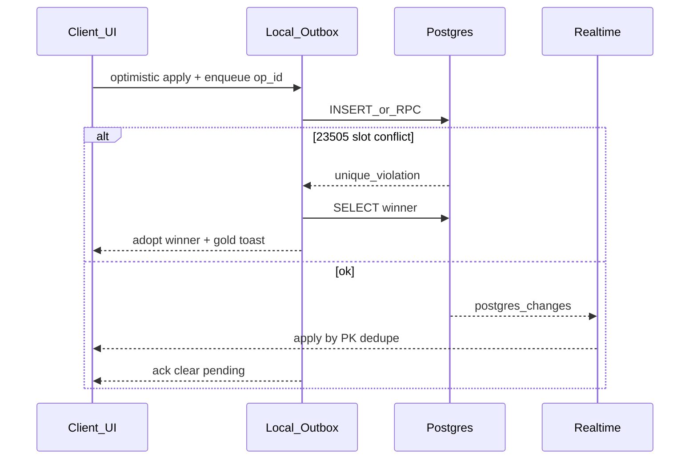

# Nuzlocke Multiplayer Concurrency — Implementation Plan

> **For agentic workers:** Execute phase-by-phase. Do not commit unless asked.  
> Spec basis: concurrency audit 2026-08-01 + SOTA research (Supabase Presence, Postgres UNIQUE-as-truth, optimistic outbox, command RPCs).

**Goal:** Make concurrent edits by multiple players in one online run race-safe without overengineering (no CRDT/OT).

**Architecture (SOTA fit for this app):**  
Postgres = source of truth · Client = optimistic cache + outbox · Realtime = fan-out after commit · Hard invariants via UNIQUE / server TX · Presence only for UX.

**Tech Stack:** Supabase Postgres + Realtime, existing `nuzlocke-store` optimistic path, vitest.

---

## Research verdict vs. our earlier proposals

| Our proposal | SOTA alignment | Decision |
|---|---|---|
| Partial unique index on slot-consuming encounters | **Core** — UNIQUE closes TOCTOU; app-level check-then-insert is insufficient ([PG UNIQUE vs app checks](https://www.distributedrequest.com/backend-implementation-storage-patterns/database-unique-constraints-upserts/postgresql-unique-constraints-vs-application-level-checks/)) | **Keep — P0** |
| Presence key = `playerId` | **Docs-required** — custom presence key must be unique per client ([Supabase Presence](https://supabase.com/docs/guides/realtime/presence)) | **Keep — P0** |
| Post-insert / realtime dupes revalidate | Good interim; full SOTA is validate-in-same-TX (RPC) | **P1 interim; RPC later for cascades** |
| Op-generation on `persistWithRetry` | Matches optimistic locking / ignore stale retries | **Keep — P1** |
| Outbox merge on `refreshRemote` | Classic local-first hydrate rule | **Keep — P1** |
| Death cascade auto like miss | Consistency > confirm UX; or single server TX | **P2 product + RPC preferred** |
| Full CRDT (Yjs/Automerge) | Wrong model — slot claims must reject, not merge | **Reject** |
| OT | Irrelevant for discrete rows | **Reject** |
| Full event sourcing | Overkill for tracker; optional audit later | **Reject for now** |
| PostgREST `.upsert({ onConflict })` on partial index | **Broken** — PostgREST can’t target partial unique WHERE ([postgrest-js#403](https://github.com/supabase/postgrest-js/issues/403)) | **Keep insert + 23505 reconcile** |

**Bottom line:** Stay in the current tier (optimistic + Supabase). Harden with DB constraints + presence + outbox/op-gen. Escalate SoulLink multi-row writes to RPCs when ready — not CRDTs.

---

## Target end-state (diagram)

---

## Phase 0 — Integrity + Presence (do first)

### 0.1 Partial unique index
- [x] Live DB: `\d nuz_encounters` / `pg_indexes` — confirm whether any unique already exists
  - *2026-08-01: kein Service-Role/CLI-Zugang; Index existiert in Repo-Migrationen bisher nicht (nur Docs-Behauptung). Nach Deploy im SQL Editor verifizieren.*
- [x] Migration `supabase/migrations/06_nuz_encounters_route_slot_uidx.sql`:
  - Deduplicate slot-consuming rows (keep oldest `created_at` per `(run_id, player_id, route_key)` where `status <> 'duped' AND coalesce(is_shiny,false) = false`)
  - `CREATE UNIQUE INDEX nuz_encounters_route_slot_uidx ON public.nuz_encounters (run_id, player_id, route_key) WHERE status <> 'duped' AND coalesce(is_shiny, false) = false;`
- [x] Align `docs/ai/architecture.md` (partial, not full unique)
- [ ] Smoke: two browsers, same player/route race → one wins, other `routeConflict` toast
  - *Blocked on live migration deploy.*

**Files:** `supabase/migrations/06_…sql`, `docs/ai/architecture.md`  
**Note:** Do **not** switch client to `.upsert({ onConflict })` against this index.

### 0.2 Presence key = player id
- [x] Change `runChannel` to accept presence key (or create channel inside `goLive` with `myPlayerId`)
- [x] `src/lib/supabase.ts`: stop using `presence: { key: runId }`
- [x] `goLive`: after `SUBSCRIBED`, `track(presenceMe)`; optional re-track on `visibilitychange`
- [ ] Smoke: 2–3 clients show distinct online dots
  - *Manual smoke after deploy / local multi session.*

**Files:** `src/lib/supabase.ts`, `src/lib/nuzlocke-store.ts` (`goLive` / `runChannel` call sites)

### 0.3 Realtime gap fill
- [x] On channel `SUBSCRIBED` / reconnect: `refreshRemote` (with Phase-1 merge once available; until then at least refetch)
  - *Review fix: pending inserts absent on server are re-merged; full outbox still Phase 1.1.*
  - *Review fix: presence key = `myPlayerId` only; stale channel guards; `goLive` retry after hydrate.*

---

## Phase 1 — Optimistic hardening

### 1.1 Outbox merge on hydrate
- [ ] Extend `RunEntry` with durable/in-memory outbox: pending encounter snapshots + op metadata keyed by `enc.id` / `client_op_id`
- [ ] `refreshRemote`: `serverRows` as base; **keep** local rows still in `pendingSync` that are absent on server (or newer pending patches); drop pending on ack/reject
- [ ] Never blind `entry.state = remote` while pending ops exist

**Files:** `src/lib/nuzlocke-store.ts` (`refreshRemote`, `persistWithRetry`, `ensureEntry`)  
**Tests:** vitest — pending insert survives simulated refresh; ack clears pending

### 1.2 Op-generation / stale retry guard
- [ ] Per `syncKey`: monotonic `opGen`; each `persistWithRetry` captures gen; on success/failure only apply if gen still current
- [ ] Optional: PATCH with `.eq('status', expected)` for status transitions (reject stale death→caught overwrite)

**Files:** `src/lib/nuzlocke-store.ts` (`persistWithRetry`)  
**Tests:** rapid dead→restore; only last write sticks

### 1.3 Dupes TOCTOU interim
- [ ] After successful multi insert **and** on realtime INSERT of another player’s catch: re-run `evoLineAliveInRun` for living family
- [ ] If violation: mark **later** row (`created_at` / not owned) as `status: 'duped'`, `in_party: false`, toast (gold), persist
- [ ] Document as interim until RPC

**Files:** `src/lib/nuzlocke-store.ts`, `src/lib/nuzlocke-rules.ts`  
**Tests:** two near-simultaneous logs different stages same line → one stays caught, one duped (simulated sequential with primed family cache)

### 1.4 Realtime apply hygiene
- [ ] Dedupe by PK (already mostly)
- [ ] Status monotonicity helpers where safe (`dead`/`lost` not silently downgraded by stale retry — ties to 1.2)

---

## Phase 2 — Server commands for multi-row truth

### 2.1 Death cascade policy (product + code)
**Recommend:** Auto-apply partner deaths when `soulLinkCascade` ON (mirror miss→`lost`), with feed/toast; keep optional confirm as UX delay ≤ N seconds then auto.  
Alternative: RPC only (below) without local double-cascade.

- [ ] Decide product: auto vs confirm-on-all-clients
- [ ] Implement chosen path; remote clients must not leave permanent rule-break

### 2.2 RPC `nuz_apply_encounter_status` (preferred for cascades)
- [ ] SECURITY INVOKER or tight DEFINER + `search_path`
- [ ] Input: `encounter_id`, `new_status`, `note?`, `client_op_id`
- [ ] Single TX: update row + SoulLink partner rows (death/miss rules) + membership check
- [ ] Client: call RPC instead of multi PATCH; Realtime still fans out

### 2.3 Optional RPC `nuz_log_encounter`
- [ ] Validate nicknames / slot / dupes family (server needs evo data **or** pass family ids from client as hint + re-check exact species set stored on run — practical v1: exact species + client family ids stored in a small `species_family` cache table later)
- [ ] Insert in TX; return winner row
- [ ] Only if Phase-1 interim dupes still flaky in practice

### 2.4 Small cleanups
- [ ] `evolveEncounter`: single PATCH
- [ ] Serialize `scheduleLinkedSync` per `(runId, playerId)` (local mutex)
- [ ] Unique `(run_id, slot)` on `nuz_players` if join races observed

---

## Explicit non-goals
- Yjs / Automerge / Loro for encounters
- Wall-clock LWW over route slots
- Presence as gameplay lock
- Full PowerSync / Watermelon offline stack (Solo stays localStorage; Multi = online+retry)

---

## Verification gate (per phase)
1. Intent check — listed files actually changed
2. `npx tsc -b` + targeted vitest (`nuzlocke-soullink`, `nuzlocke-dupes`, new concurrency tests)
3. Manual: 2 browsers, same run — online dots, double-claim route, reconnect mid-pending, SoulLink miss/death
4. After migrations: `node scripts/check-rls.mjs` if policies touched; confirm index exists live

---

## Suggested execution order for agents
1. Phase 0.1 migration (+ live verify)  
2. Phase 0.2–0.3 presence + SUBSCRIBED refresh  
3. Phase 1.1–1.2 outbox + opGen  
4. Phase 1.3 dupes revalidate  
5. Phase 2 after product call on death cascade  

**Stop between phases for a short human smoke if DB migration is involved.**
